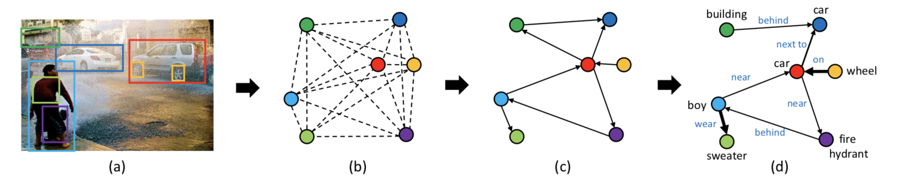

# graph-rcnn.pytorch
Pytorch code for our ECCV 2018 paper ["Graph R-CNN for Scene Graph Generation"](https://arxiv.org/pdf/1808.00191.pdf)

<div style="color:#0000FF" align="center">

</div>

## Introduction
Graph RCNN for Scene Graph generation.
Download the pre-trained weights with links below:
Faster RCNN:
https://drive.google.com/open?id=1EFPliwyKpQ5dvEZVR1wvgzTruq-c7J_M
Scene graph generation baseline:
https://drive.google.com/open?id=1raeDglRaAOjUAbhEwN4M4dHZ9lJQNE4Z
Scene graph generation imp:
https://drive.google.com/open?id=1HOGrkTOlraq5xrsCuJEsKmW9lFniD2IQ

## Installation

### Prerequisites

* Python 3.6+
* Pytorch 1.0
* CUDA 8.0+

### Dependencies

Install all the python dependencies using pip:
```
pip install -r requirements.txt
```

and libraries using apt-get:
```
apt-get update
apt-get install libglib2.0-0
apt-get install libsm6
```

### Data Preparation

* Visual Genome benchmarking dataset:

Annotations | Object | Predicate
------------|--------| ---------
\#Categories| 150    | 50

First, make a folder in the root folder:
```
mkdir -p datasets/vg_bm
```

Here, the suffix 'bm' is in short of "benchmark" representing the dataset for benchmarking. We may have other format of vg dataset in the future, e.g., more categories.

Then, download the data and preprocess the data according following this [repo](https://github.com/danfeiX/scene-graph-TF-release). Specifically, after downloading  the [visual genome dataset](https://visualgenome.org/), you can follow this [guidelines](https://github.com/danfeiX/scene-graph-TF-release/tree/master/data_tools) to get the following files:

```
datasets/vg_bm/imdb_1024.h5
datasets/vg_bm/bbox_distribution.npy
datasets/vg_bm/proposals.h5
datasets/vg_bm/VG-SGG-dicts.json
datasets/vg_bm/VG-SGG.h5
```

The above files will provide all the data needed for training the object detection models and scene graph generation models listed above.

### Compilation

Compile the cuda dependencies using the following commands:
```
cd lib/scene_parser/rcnn
python setup.py build develop
```

After that, you should see all the necessary components, including nms, roi_pool, roi_align are compiled successfully.

## Train

### Train object detection model:

* Faster r-cnn model with resnet-101 as backbone:
```
python main.py --config-file configs/faster_rcnn_res101.yaml
```

Multi-GPU training:
```
python -m torch.distributed.launch --nproc_per_node=$NGPUS main.py --config-file configs/faster_rcnn_res101.yaml
```
where NGPUS is the number of gpus available.

### Train scene graph generation model jointly (train detector and sgg as a whole):

* Vanilla scene graph generation model with resnet-101 as backbone:
```
python main.py --config-file configs/sgg_res101_joint.yaml --algorithm $ALGORITHM
```

Multi-GPU training:
```
python -m torch.distributed.launch --nproc_per_node=$NGPUS main.py --config-file configs/sgg_res101_joint.yaml --algorithm $ALGORITHM
```
where NGPUS is the number of gpus available. ALGORIHM is the scene graph generation model name.

### Train scene graph generation model stepwise (train detector first, and then sgg):

* Vanilla scene graph generation model with resnet-101 as backbone:
```
python main.py --config-file configs/sgg_res101_step.yaml --algorithm $ALGORITHM
```

Multi-GPU training:
```
python -m torch.distributed.launch --nproc_per_node=$NGPUS main.py --config-file configs/sgg_res101_step.yaml --algorithm $ALGORITHM
```
where NGPUS is the number of gpus available. ALGORIHM is the scene graph generation model name.

## Evaluate

### Evaluate object detection model:

* Faster r-cnn model with resnet-101 as backbone:
```
python main.py --config-file configs/faster_rcnn_res101.yaml --inference --resume $CHECKPOINT
```
where CHECKPOINT is the iteration number. By default it will evaluate the whole validation/test set. However, you can specify the number of inference images by appending the following argument:
```
--inference $YOUR_NUMBER
```

:warning: If you want to evaluate the model at your own path, just need to change the MODEL.WEIGHT_DET to your own path in faster_rcnn_res101.yaml.

### Evaluate scene graph frequency baseline model:

In this case, you do not need any sgg model checkpoints. To get the evaluation result, object detector is enough. Run the following command:
```
python main.py --config-file configs/sgg_res101_{joint/step}.yaml --inference --use_freq_prior
```

In the yaml file, please specify the path MODEL.WEIGHT_DET for your object detector.

### Evaluate scene graph generation model:

* Scene graph generation model with resnet-101 as backbone:
```
python main.py --config-file configs/sgg_res101_{joint/step}.yaml --inference --resume $CHECKPOINT --algorithm $ALGORITHM
```

* Scene graph generation model with resnet-101 as backbone and use frequency prior:
```
python main.py --config-file configs/sgg_res101_{joint/step}.yaml --inference --resume $CHECKPOINT --algorithm $ALGORITHM --use_freq_prior
```

Similarly you can also append the ''--inference $YOUR_NUMBER'' to perform partially evaluate.

:warning: If you want to evaluate the model at your own path, just need to change the MODEL.WEIGHT_SGG to your own path in sgg_res101_{joint/step}.yaml.

### Visualization

If you want to visualize some examples, you just simple append the command with:
```
--visualize
```

## Citation

    @inproceedings{yang2018graph,
        title={Graph r-cnn for scene graph generation},
        author={Yang, Jianwei and Lu, Jiasen and Lee, Stefan and Batra, Dhruv and Parikh, Devi},
        booktitle={Proceedings of the European Conference on Computer Vision (ECCV)},
        pages={670--685},
        year={2018}
    }
